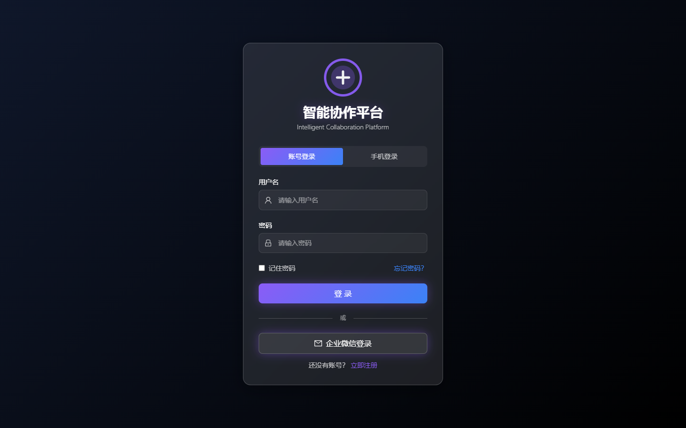
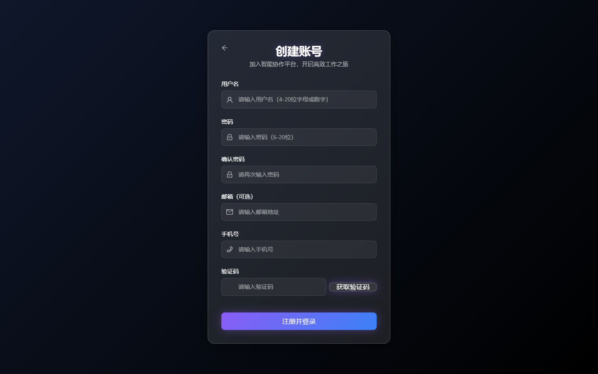
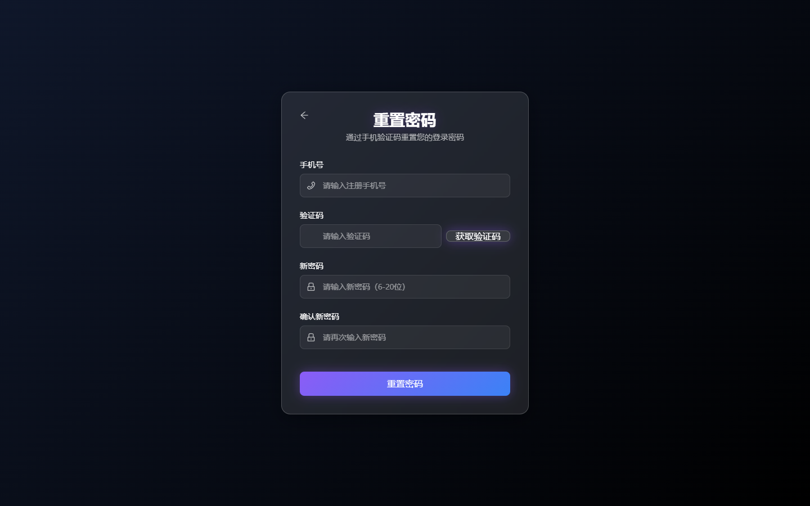
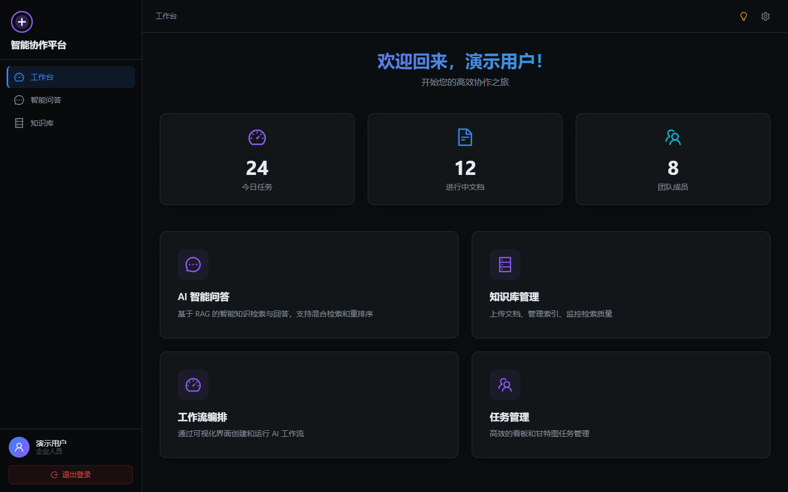
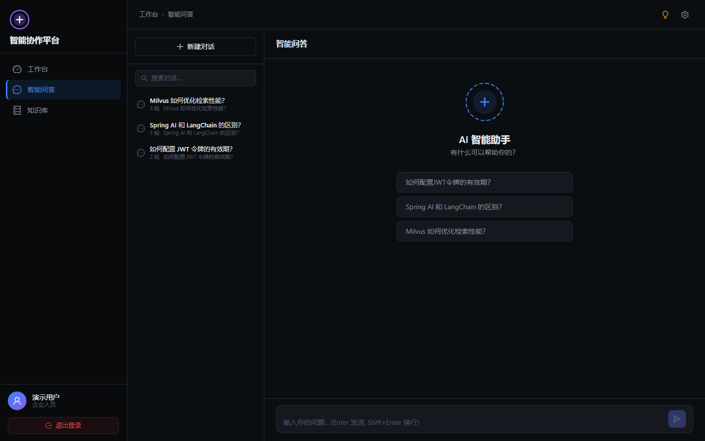
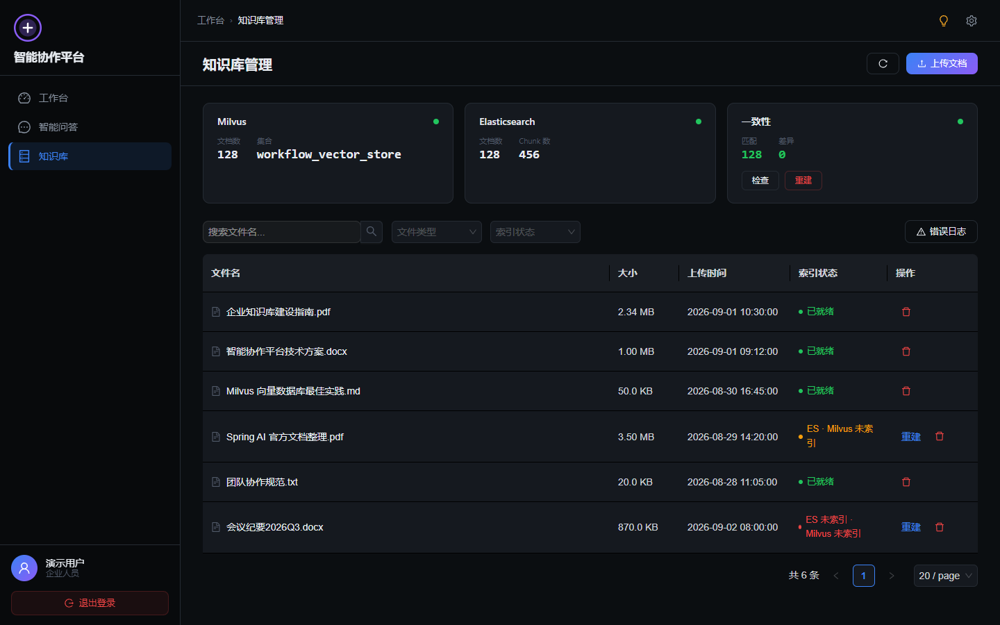

# 智能协作平台 · 系统效果图与操作说明

> 本文档基于系统实际界面截图，逐一说明各功能页面的布局、字段与操作步骤，供演示、培训与验收使用。

---

## 一、系统简介

智能协作平台是一套企业级 **智能 RAG 知识问答** 系统，主要能力包括：

- **知识库管理**：上传 PDF / DOCX / MD / TXT 文档，自动解析、分块并建立向量索引。
- **智能问答**：基于混合检索（Milvus 向量 + Elasticsearch 全文）与 BGE 重排序，从知识库中检索并生成带引用的回答，全程可视化展示"思考过程"。
- **引用溯源**：回答中的关键信息可追溯到原始文档片段。
- **对话记忆**：多轮对话上下文记忆，支持指代消解与查询重写。

**技术栈**：Vue 3 + Spring Boot + Spring AI + Milvus + Elasticsearch + Redis。

---

## 二、界面总览

登录后进入主界面，整体采用「暗色霓虹」风格，布局由三部分组成：

| 区域 | 位置 | 说明 |
| --- | --- | --- |
| 侧边栏 | 左侧 | 平台 Logo、导航菜单（工作台 / 智能问答 / 知识库）、用户信息与退出登录 |
| 顶栏 | 顶部 | 面包屑导航、主题切换、设置入口 |
| 内容区 | 中间 | 当前模块的页面内容 |

---

## 三、功能页面操作说明

### 1. 登录页

**页面构成**：平台 Logo 与标题、登录方式切换 Tab、登录表单。

**操作步骤**：

1. 选择登录方式：**账号登录**（默认）或 **手机登录**。
2. 账号登录：输入 `用户名`、`密码`，可勾选「记住密码」，点击 **登 录** 按钮。
3. 手机登录：输入 `手机号`，点击「获取验证码」，输入短信验证码后点击 **登 录**。
4. 辅助入口：
   - 点击「忘记密码？」跳转重置密码页。
   - 点击「立即注册」跳转注册页。
   - 「企业微信登录」为预留入口（当前未实现）。

---

### 2. 注册页

**页面构成**：返回按钮、标题、注册表单。

**字段说明**：

| 字段 | 校验规则 |
| --- | --- |
| 用户名 | 4–20 位字母或数字，必填 |
| 密码 | 6–20 位，必填，实时显示密码强度（弱/中/强） |
| 确认密码 | 与密码一致，实时校验匹配 |
| 邮箱 | 可选 |
| 手机号 | 必填，需符合手机号格式 |
| 验证码 | 必填，点击「获取验证码」发送 |

**操作步骤**：

1. 依次填写用户名、密码、确认密码、邮箱（可选）、手机号。
2. 点击「获取验证码」，填写收到的短信验证码。
3. 点击 **注册并登录**；成功后自动跳转登录页。

---

### 3. 重置密码页

**操作步骤**：

1. 输入注册时绑定的 `手机号`。
2. 点击「获取验证码」，填写短信验证码。
3. 输入 `新密码`（6–20 位，含强度提示）与 `确认新密码`。
4. 点击 **重置密码**；成功后自动跳转登录页。

---

### 4. 工作台

**页面构成**：

- **欢迎语**：`欢迎回来，{用户名}！`
- **统计卡片**：今日任务、进行中文档、团队成员。
- **功能入口卡片**：AI 智能问答、知识库管理、工作流编排、任务管理（点击跳转对应模块）。

**操作**：点击任一功能卡片即可进入对应模块。

---

### 5. 智能问答

**页面构成**（左右两栏）：

- **左侧 · 会话列表**：
  - 「新建对话」按钮；
  - 对话搜索框；
  - 历史会话项（显示标题、轮数、最近内容预览，悬停可删除）。
- **右侧 · 聊天区**：
  - 顶部显示当前对话标题；
  - 消息区（无消息时显示「AI 智能助手」空状态与推荐问题）；
  - 底部输入框（`Enter` 发送，`Shift+Enter` 换行）。

**操作步骤**：

1. 点击「新建对话」或选择历史会话。
2. 在底部输入框输入问题，点击发送（或按 `Enter`）。
3. 系统依次执行：意图路由 → 查询重写 → 混合检索 → 重排序 → 生成回答，过程中以「思考过程」可视化展示各阶段状态。
4. 回答完成后可查看引用的知识库片段，实现溯源。

---

### 6. 知识库管理

**页面构成**：

- **索引状态卡片**（顶部三张）：
  - **Milvus**：文档数、集合名，状态指示灯；
  - **Elasticsearch**：文档数、Chunk 数，状态指示灯；
  - **一致性**：匹配数、差异数，附「检查」与「重建」按钮。
- **工具栏**：文件名搜索、文件类型筛选、索引状态筛选、错误日志入口。
- **文档列表**：文件名、大小、上传时间、索引状态（已就绪/部分就绪/待索引）、操作（重建/删除）。

**操作步骤**：

1. **上传文档**：点击右上角「上传文档」，拖拽或选择文件（支持 PDF、DOC、DOCX、TXT、MD，单文件 ≤ 50MB），点击「上传」。
2. **搜索/筛选**：输入文件名关键词，或按文件类型 / 索引状态筛选。
3. **重建索引**：点击一致性卡片或某条记录的「重建」按钮，选择目标（Milvus / ES / 全部）。
4. **一致性检查**：点击「检查」按钮，比对 Milvus 与 ES 的文档集合差异。
5. **删除文档**：点击记录右侧删除图标，确认后级联清理 ES、Milvus、MinIO 与数据库。
6. **错误日志**：点击「错误日志」查看分页的索引/检索错误详情。

---

## 四、设置面板

点击顶栏「设置」图标打开右侧设置抽屉，包含：

| 分组 | 配置项 |
| --- | --- |
| 外观 | 暗色 / 亮色主题切换 |
| 对话 | 流式输出速度（快速 / 正常 / 慢速） |
| 记忆压缩 | 历史保留天数、自动压缩阈值（轮） |
| 知识库 | 默认检索数量、是否显示相关性分数 |
| 关于 | 系统版本与技术栈信息 |

---

## 五、典型操作流程

**从上传文档到提问的完整链路**：

1. 登录系统 → 进入「知识库」。
2. 上传文档，等待索引状态变为「已就绪」（Milvus 与 ES 双写成功）。
3. 进入「智能问答」，新建对话。
4. 输入问题，观察思考过程（意图 → 重写 → 检索 → 重排）。
5. 查看回答与引用来源，完成知识溯源。

---

> 注：截图中登录后页面的业务数据（文档列表、会话记录等）为演示数据，实际数据由后端服务返回。
