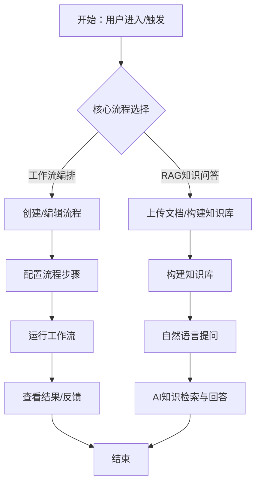
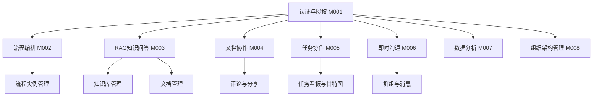

# 智能协作平台 产品需求文档 (PRD)

> **模板版本:** 1.0
> **生成时间:** 2026/04/29
> **状态:** 草稿
> **版本:** v1.0

## 目录

1. [文档基础信息](#1-文档基础信息)
2. [项目背景与目标](#2-项目背景与目标)
3. [核心业务流程](#3-核心业务流程)
4. [功能模块清单](#4-功能模块清单)
5. [用户故事概述](#5-用户故事概述)
6. [非功能需求](#6-非功能需求)
7. [项目级验收标准](#7-项目级验收标准)
8. [项目计划与里程碑](#8-项目计划与里程碑)
9. [附录](#9-附录)

---

## 1. 文档基础信息

| 字段 | 内容 |
| --- | --- |
| 文档名称 | 智能协作平台 产品需求文档 |
| 作者 | AI Assistant |
| 创建时间 | 2026/04/29 |
| 当前版本 | v1.0 |
| 变更日志 | 见下方章节 |

### 1.1 变更日志

| 日期 | 版本 | 概述 | 作者 |
|------------|------|----------------|--------------|
| 2026/04/29 | v1.0 | 初始版本 | AI Assistant |
| | | | |

---

## 2. 项目背景与目标

### 2.1 背景说明

在数字化转型的背景下，企业团队面临着协作效率低下、信息孤岛严重、工作流程不透明的痛点。传统的协作方式依赖分散的工具和繁琐的流程，导致团队沟通成本高、协同效率低、知识沉淀困难。

随着人工智能技术的发展，企业急需一种集文档协作、任务管理、即时沟通、数据分析于一体的智能协作平台，能够通过 AI 驱动的工作流编排和 RAG 知识问答能力，大幅提升团队协作效率和决策质量。

### 2.2 产品目标

- 提供一站式智能协作解决方案，整合文档协作、任务协作、数据分析、即时沟通等核心能力
- 通过 AI 驱动的流程编排和知识问答，显著提升团队协作效率和工作质量
- 优化企业工作流程，实现知识的沉淀、共享和复用
- 为业务人员提供易用的界面和强大的 AI 能力，降低使用门槛

---

## 3. 核心业务流程

### 3.1 业务流程概述

平台的核心业务流程分为两个主要方向：

1. **工作流编排流程**：用户通过可视化流程编排工具创建和运行 AI 工作流，通过定义步骤、参数和条件，让 AI 自动完成复杂任务，支持多轮对话和动态调整。

2. **RAG 知识问答流程**：用户上传文档构建知识库，通过自然语言提问获取精准的答案，结合企业内部知识库和外部数据源，实现智能化的知识检索和问答。

### 3.2 业务流程图

---

## 4. 功能模块清单

### 4.1 模块列表（模块划分颗粒度）

| 编号 | 模块名称 | 描述 | 优先级 | 备注 |
| --- | --- | --- | --- | --- |
| M001 | 认证与授权 | 用户登录、注册、权限管理 | 高 | 支持多种认证方式，细粒度权限控制 |
| M002 | 流程编排 | 类似 coze 的 AI 工作流编排功能 | 高 | 可视化编排，支持多步 AI 任务 |
| M003 | RAG 知识问答 | 智能文档问答、知识库管理 | 高 | 支持多种文档格式，向量检索 |
| M004 | 文档协作 | 在线文档编辑、版本管理、协同 | 中 | 实时协作、评论、分享 |
| M005 | 任务协作 | 任务管理、进度跟踪、团队协作 | 中 | 看板视图、甘特图、待办事项 |
| M006 | 即时沟通 | 即时消息、群组聊天、文件分享 | 中 | 实时消息、消息已读状态 |
| M007 | 数据分析 | 数据可视化、报表生成、趋势分析 | 低 | 多种图表类型、自定义仪表盘 |
| M008 | 组织架构管理 | 用户管理、角色管理、部门管理 | 中 | 树形结构、权限分配 |

### 4.2 模块关系图

---

## 5. 用户故事概述

### 5.1 用户角色与权限

| 角色 | 描述 | 权限 |
| --- | --- | --- |
| 管理员 | 系统管理员，负责配置和监控 | 全部权限、系统配置、用户管理、监控查看 |
| 企业人员 | 平台主要用户，使用协作功能 | 基础协作功能、创建流程、管理知识库 |
| 项目经理 | 负责项目规划和任务管理 | 全部权限、任务管理、进度跟踪、报表查看 |

### 5.2 高层用户故事

- **US-1:** 作为**企业人员**，我希望**创建和运行 AI 工作流**，以便于**自动化完成复杂任务，提升工作效率**
- **US-2:** 作为**企业人员**，我希望**上传文档并构建知识库**，以便于**快速检索企业知识，获取精准答案**
- **US-3:** 作为**项目经理**，我希望**管理团队成员和任务**，以便于**协调项目进度，确保任务按时完成**
- **US-4:** 作为**企业人员**，我希望**实时协作编辑文档**，以便于**与团队成员同步工作，减少沟通成本**
- **US-5:** 作为**企业人员**，我希望**查看数据分析报表**，以便于**了解项目进展和团队绩效**

---

## 6. 非功能需求

| 类型 | 说明 |
| --- | --- |
| 响应时间 | 页面交互 ≤ 2s，接口响应 ≤ 1s，AI 工作流运行响应 ≤ 30s |
| 浏览器兼容 | Chrome ≥ 90，Firefox，Safari，Edge |
| 安全性 | 数据加密传输，CSRF 防护，XSS 过滤，权限验证，SQL 注入防护 |
| 可用性 | 系统可用性 ≥ 99.9%，支持灰度发布和快速回滚 |
| 可扩展性 | 支持水平扩展，模块化设计，API 接口标准化 |
| 高可用 | 关键服务多实例部署，自动故障转移，数据备份 |
| 可观测性 | 完整的日志和监控，支持分布式链路追踪 |

---

## 7. 项目级验收标准

### 7.1 功能验收

- 认证与授权模块：支持登录、注册、权限管理，满足安全要求
- 流程编排模块：支持可视化编排、多步 AI 任务调用、参数配置、结果展示
- RAG 知识问答模块：支持文档上传、知识库构建、自然语言问答、准确率 ≥ 90%
- 文档协作模块：支持实时编辑、版本管理、评论、分享，协作流畅
- 任务协作模块：支持看板、甘特图、任务分配、进度跟踪
- 即时沟通模块：支持实时消息、群组聊天、消息已读状态

### 7.2 性能验收

- 页面加载时间 ≤ 2s，关键接口响应时间 ≤ 1s
- 支持 1000 并发用户访问，系统稳定运行
- AI 工作流运行时间 ≤ 30s，知识问答响应时间 ≤ 5s
- 系统连续运行 7 天无异常

### 7.3 业务目标验收

- 流程编排模块：支持至少 10 种预置流程模板
- RAG 知识问答模块：支持至少 5 种文档格式（PDF、Word、Excel、PPT、TXT）
- 用户注册率 ≥ 50%，活跃用户占比 ≥ 30%

---

## 8. 项目计划与里程碑

### 8.1 模块依赖与开发顺序

| 编号 | 模块名称 | 依赖模块 | 开发顺序 | 备注 |
| --- | --- | --- | --- | --- |
| M001 | 认证与授权 | - | 1 | 基础模块，所有其他模块依赖 |
| M008 | 组织架构管理 | M001 | 2 | 用户和权限管理基础 |
| M004 | 文档协作 | M001、M008 | 3 | 协作功能基础 |
| M006 | 即时沟通 | M001、M008 | 4 | 协作功能基础 |
| M005 | 任务协作 | M001、M008 | 5 | 协作功能基础 |
| M002 | 流程编排 | M001、M004、M006 | 6 | 需要文档和协作能力支持 |
| M003 | RAG 知识问答 | M001、M008、M004 | 7 | 需要文档管理能力支持 |
| M007 | 数据分析 | M001、M005、M006 | 8 | 需要任务和沟通数据 |

### 8.2 三方系统集成（如有）

| 系统名称 | 集成方式 | 用途 | 备注 |
| --- | --- | --- | --- |
| Milvus | SDK 集成 | 向量数据库，用于 RAG 知识检索 | 需要部署 Milvus 服务 |
| Redis | SDK 集成 | 缓存、会话管理、消息队列 | 需要部署 Redis 服务 |
| MinIO | SDK 集成 | 文件存储、文档上传下载 | 需要部署 MinIO 服务 |
| RabbitMQ | SDK 集成 | 消息队列，异步处理 | 需要部署 RabbitMQ 服务 |
| Higress | API Gateway | 服务网关、路由、鉴权 | 需要部署 Higress 服务 |
| Prometheus + Grafana | Agent/SDK | 监控和指标收集 | 需要部署监控服务 |
| ARMS | SDK 集成 | 可观测性、链路追踪 | 云服务 |

### 8.3 里程碑

| 里程碑 | 交付物 | 状态 |
| --- | --- | --- |
| M001 认证与授权完成 | 完成登录注册、权限管理功能 | 未开始 |
| M002 基础协作完成 | 完成文档协作、即时沟通、任务协作功能 | 未开始 |
| M003 流程编排完成 | 完成可视化编排、AI 工作流运行功能 | 未开始 |
| M004 RAG 知识问答完成 | 完成知识库构建、智能问答功能 | 未开始 |
| M005 系统集成完成 | 所有模块集成测试通过 | 未开始 |
| M006 上线发布 | 系统正式上线，监控系统就绪 | 未开始 |

---

## 9. 附录

### 9.1 术语定义

| 术语 | 解释 |
| --- | --- |
| RAG | Retrieval-Augmented Generation，检索增强生成，结合检索和生成能力 |
| 流程编排 | 通过可视化界面配置 AI 工作流的步骤、参数和条件 |
| 向量数据库 | 存储文本向量的数据库，用于语义检索 |
| 可观测性 | 系统监控、日志、链路追踪的综合指标 |
| 流行度 | 流程模板被使用的次数 |

### 9.2 参考资料

- Coze 流程编排技术规范
- RAG 知识库技术规范
- Spring Boot 3.x 技术文档
- Vue 3 + Ant Design Vue 开发指南
