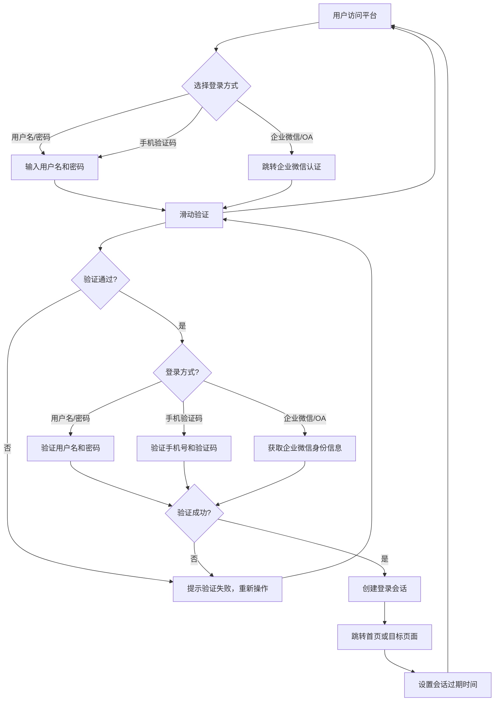
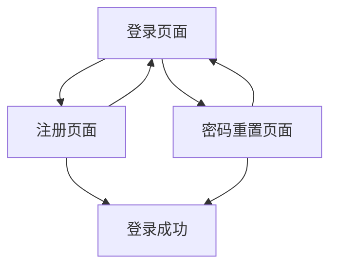
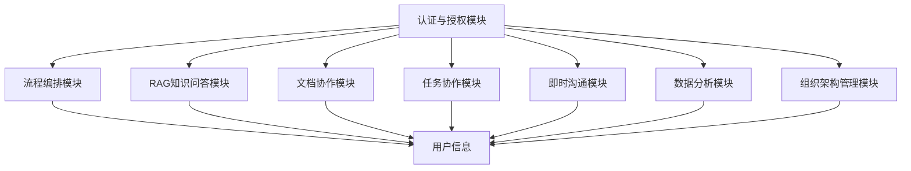
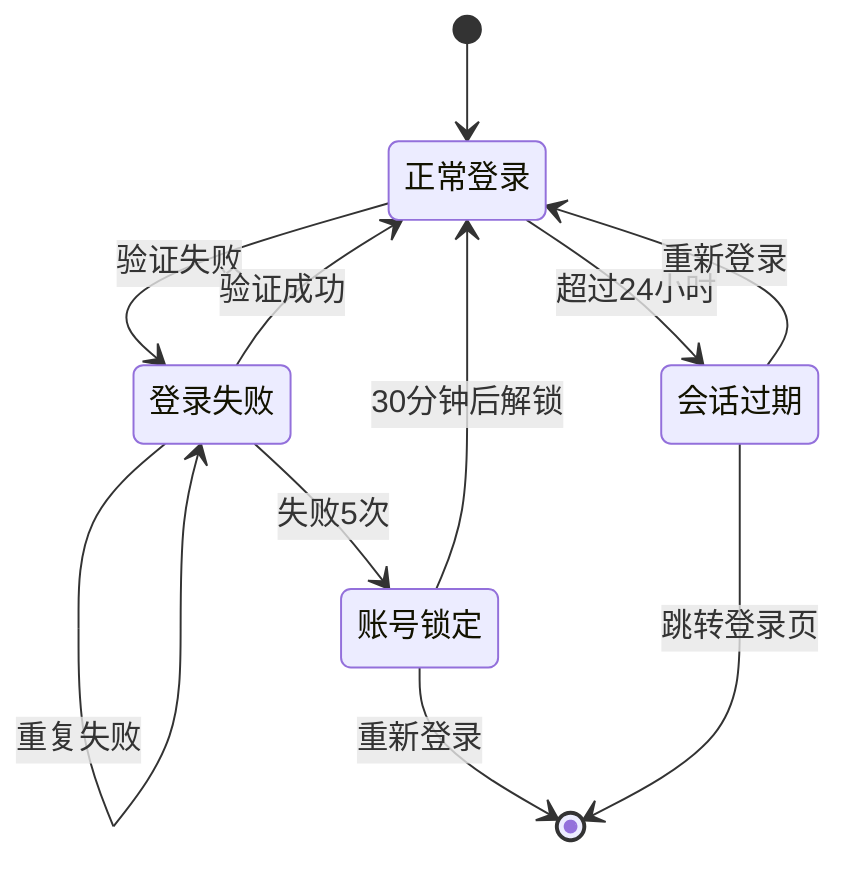

# 认证与授权模块 产品需求文档 (PRD)

> **模板版本:** 1.0
> **生成时间:** 2026/04/29
> **状态:** 草稿
> **关联主PRD:** 智能协作平台 v1.0

## 目录

1. [文档基础信息](#1-文档基础信息)
2. [模块背景与目标](#2-模块背景与目标)
3. [详细功能需求](#3-详细功能需求)
4. [数据字段定义](#4-数据字段定义)
5. [用户故事详述](#5-用户故事详述)
6. [用户界面设计](#6-用户界面设计)
7. [业务规则与边界条件](#7-业务规则与边界条件)
8. [与其他模块的集成](#8-与其他模块的集成)
9. [异常与错误处理](#9-异常与错误处理)
10. [埋点与数据指标](#10-埋点与数据指标)
11. [模块级验收标准](#11-模块级验收标准)
12. [附录](#12-附录)

---

## 1. 文档基础信息

| 字段 | 内容 |
| --- | --- |
| 文档名称 | 认证与授权模块 产品需求文档 |
| 作者 | AI Assistant |
| 创建时间 | 2026/04/29 |
| 当前版本 | v1.1 |
| 变更日志 | 见下方章节 |

### 1.1 变更日志

| 日期 | 版本 | 概述 | 作者 |
|------------|------|----------------|--------------|
| 2026/04/29 | v1.0 | 初始版本 | AI Assistant |
| 2026/05/06 | v1.1 | 补充 F-08 会话管理与 F-09 权限控制的实现描述 | AI Assistant |

---

## 2. 模块背景与目标

### 2.1 模块背景

认证与授权是智能协作平台的基础模块，负责用户身份验证和权限控制。该模块在主 PRD 中被列为优先级最高的模块（M001），是所有其他功能模块的基础依赖。用户只有在完成认证后，才能访问平台的其他功能。

本模块需要支持多种登录方式，确保用户体验流畅且安全。同时，通过精细的权限控制机制，保障企业数据的安全性。

### 2.2 模块目标

- 提供安全可靠的登录、注册功能，支持多种登录方式
- 实现细粒度的权限控制和会话管理
- 通过炫酷动态的 UI 设计提升用户第一印象
- 确保系统安全，防止未授权访问和数据泄露
- 为用户提供流畅、便捷的认证体验

---

## 3. 详细功能需求

### 3.1 功能清单

| 编号 | 功能名称 | 描述 | 备注 |
| --- | --- | --- | --- |
| F-01 | 登录功能 | 支持用户名/密码、手机验证码、企业微信/OA 登录 | 核心功能 |
| F-02 | 注册功能 | 支持用户名、密码、手机号注册 | 核心功能 |
| F-03 | 登录切换动画 | 登录和注册页面平滑切换动画 | 视觉增强 |
| F-04 | 密码重置 | 支持忘记密码功能，通过手机验证码重置密码 | 安全增强 |
| F-05 | 记住密码 | 登录时提供"记住密码"选项 | 用户体验 |
| F-06 | 验证码倒计时 | 手机验证码倒计时 60 秒，防止频繁发送 | 安全控制 |
| F-07 | 滑动验证 | 登录注册时通过滑动验证验证用户为真人 | 安全控制 |
| F-08 | 会话管理 | 登录后的会话保持和自动登出机制 | 安全增强 |
| F-09 | 权限控制 | 基于角色的访问控制（RBAC） | 核心功能 |

### 3.2 功能流程图



### 3.3 功能详细说明

#### 功能点 1: 登录功能
- **入口：** 从平台首页或直接访问登录页面
- **权限：** 任何未登录用户均可使用
- **功能逻辑：**
  - 选择登录方式（用户名/密码、手机验证码、企业微信/OA）
  - 用户名/密码方式：输入用户名和密码 → 点击登录 → 系统验证 → 验证成功创建会话
  - 手机验证码方式：输入手机号 → 获取验证码（滑动验证） → 输入验证码 → 点击登录 → 系统验证
  - 企业微信/OA方式：跳转企业微信认证页面 → 授权成功 → 获取身份信息 → 自动登录
  - 边界：用户不存在、密码错误、验证码错误、网络异常、重复登录
- **涉及字段：** 用户名、密码、手机号、验证码、令牌
- **交互规则：**
  - 登录成功后自动跳转到首页或上次访问的页面
  - 验证码支持 60 秒倒计时，倒计时期间不可重新发送
  - 记住密码功能会加密存储用户名（不存储密码）
  - 连续失败 5 次，账号临时锁定 30 分钟

#### 功能点 2: 注册功能
- **入口：** 登录页面点击"注册"按钮
- **权限：** 未登录用户均可使用
- **功能逻辑：**
  - 点击注册按钮 → 切换到注册页面（带切换动画）
  - 输入用户名（4-20 位字母或数字）
  - 输入密码（6-20 位，需包含字母和数字）
  - 输入确认密码
  - 输入手机号
  - 获取手机验证码（滑动验证）
  - 点击注册按钮 → 系统验证 → 创建用户 → 自动登录
  - 边界：用户名已存在、密码不一致、手机号已注册、验证码错误
- **涉及字段：** 用户名、密码、确认密码、手机号、验证码
- **交互规则：**
  - 用户名实时校验，重复时提示不可用
  - 密码强度实时显示
  - 手机号格式实时校验
  - 验证码倒计时 60 秒

#### 功能点 3: 密码重置
- **入口：** 登录页面点击"忘记密码"
- **权限：** 输入手机号的用户均可使用
- **功能逻辑：**
  - 输入手机号 → 获取验证码（滑动验证）
  - 输入新密码（6-20 位）
  - 输入确认新密码
  - 点击重置 → 系统更新密码 → 跳转登录页面 → 提示密码已重置
  - 边界：手机号未注册、验证码错误、密码不一致
- **涉及字段：** 手机号、验证码、新密码、确认新密码
- **交互规则：**
  - 重置成功后，使用新密码登录
  - 验证码 60 秒倒计时

#### 功能点 4: 记住密码
- **入口：** 登录页面勾选"记住密码"
- **权限：** 登录时选择
- **功能逻辑：**
  - 勾选"记住密码" → 下次访问时自动填充用户名
  - 取消勾选 → 下次访问不自动填充
- **涉及字段：** 用户名（加密存储）
- **交互规则：**
  - 用户名加密存储，不存储明文密码
  - 浏览器关闭后清除记住的用户名

#### 功能点 5: 会话管理（F-08）
- **入口：** 用户登录成功后自动启用
- **权限：** 所有已登录用户
- **功能逻辑：**
  - 登录成功后记录 `lastLoginTime`（最后登录时间），重置 `loginFailCount`（登录失败次数）为 0
  - 登录失败时递增 `loginFailCount`，连续失败 5 次账户锁定（`isLocked()`），锁定后在密码校验之前即被拒绝
  - 前端 JWT 过期检查：每 60 秒解析 JWT 的 `exp` 声明，令牌过期自动登出
  - 前端空闲超时：监听 `mousedown`、`mousemove`、`keydown`、`scroll`、`touchstart`、`click` 事件，30 分钟无操作自动登出
  - `startSessionTracking()` / `stopSessionTracking()` 与登录/登出生周期绑定
  - `initialize()` 在 App.vue 挂载时调用，页面刷新时从 localStorage 恢复会话
- **涉及字段：** lastLoginTime、loginFailCount、JWT exp 声明
- **交互规则：**
  - 空闲超时前弹出提示"您已长时间未操作，即将自动退出登录"
  - 令牌过期前不提前刷新，过期后需重新登录
  - 账号锁定后提示"Account is locked due to too many failed login attempts"
- **实现文件：**
  - 后端: `AuthService.java` — login()、phoneLogin() 方法
  - 前端: `stores/auth.ts` — JWT 过期定时器、空闲超时监听

#### 功能点 6: 权限控制（F-09）
- **入口：** 用户登录时 JWT 嵌入角色声明，每次请求从 JWT 提取角色
- **权限：** 基于角色，`ROLE_ADMIN` 可访问管理接口，`ROLE_USER` 为默认角色
- **功能逻辑：**
  - JWT 生成时嵌入 `role` 声明：`jwtUtil.generateToken(username, role)`
  - JWT 验证时提取角色：`jwtUtil.extractRole(token)`，为空时默认 `ROLE_USER`
  - `JwtAuthenticationFilter` 将角色设置为 `SimpleGrantedAuthority`，不再硬编码 `ROLE_USER`
  - `SecurityConfig` 中 `/api/admin/**` 路径限制为 `hasRole("ADMIN")`
  - `AuthController.getUserInfo()` 从 `SecurityContextHolder` 获取真实用户数据（id, username, email, phone, role），不再返回占位数据
  - `LoginResponse` DTO 增加 `role` 字段，登录响应携带角色信息
- **涉及字段：** role（JWT claim）、SimpleGrantedAuthority
- **交互规则：**
  - 前端 `stores/auth.ts` 暴露 `role` 和 `isAdmin` 计算属性（getter）
  - 前端 `types/auth.ts` 在 `UserInfo` 和 `LoginResponse` 接口中增加 `role?: string`
  - 403 响应时提示"没有权限访问"
- **实现文件：**
  - 后端: `JwtUtil.java`、`JwtAuthenticationFilter.java`、`SecurityConfig.java`、`AuthController.java`、`LoginResponse.java`、`AuthService.java`
  - 前端: `stores/auth.ts`、`types/auth.ts`

---

## 4. 数据字段定义

### 4.1 字段定义表

| 字段名称 | 字段类型 | 长度/格式 | 必填 | 默认值 | 校验规则 | 说明 |
| --- | --- | --- | --- | --- | --- | --- |
| 用户名 | 字符 | 4-20 字符 | 是 | - | 仅字母或数字，唯一，首尾字母为字母 | 登录账号 |
| 密码 | 字符 | 6-20 字符 | 是 | - | 至少包含字母和数字，不能与用户名相同 | 登录密码 |
| 确认密码 | 字符 | 6-20 字符 | 是 | - | 与密码一致 | 确认密码 |
| 手机号 | 字符 | 11 位数字 | 是 | - | 以 1 开头，第二位为 3-9，唯一 | 注册手机号 |
| 验证码 | 字符 | 6 位数字 | 是 | - | 6 位数字，验证码有效期 5 分钟 | 手机验证码 |
| 令牌 | 字符 | 128 字符 | 否 | - | JWT 格式，包含用户 ID、过期时间、签名 | 登录会话令牌 |
| 过期时间 | 数字 | 整数 | 否 | 24 小时 | 大于 0，小于 30 天 | 会话过期时间 |
| 账户状态 | 字符 | 1 字符 | 否 | 正常 | 正常/锁定/禁用 | 用户账户状态 |
| 最后登录时间 | 日期 | YYYY-MM-DD HH:mm:ss | 否 | - | 格式化时间戳 | 用户最后登录时间 |
| 登录次数 | 数字 | 整数 | 否 | 0 | 大于等于 0 | 用户登录次数 |

### 4.2 字段类型说明

| 类型 | 说明 | 示例 |
| --- | --- | --- |
| 字符 | 字符串文本，需指定长度范围 | 用户名（4-20字符）、手机号（11位数字） |
| 数字 | 整数或小数，需指定范围和精度 | 过期时间（24-720小时）、登录次数（整数） |
| 日期 | 日期或日期时间，需指定格式 | 最后登录时间（YYYY-MM-DD HH:mm:ss） |

### 4.3 字段校验规则补充

#### 用户名校验规则
- 格式：仅包含字母（a-z, A-Z）或数字（0-9）
- 长度：4-20 字符
- 唯一性：用户名全局唯一
- 格式示例：`admin`, `user001`, `Test123`

#### 密码校验规则
- 长度：6-20 字符
- 复杂度：至少包含 1 个字母和 1 个数字
- 安全性：不能与用户名相同
- 格式示例：`Password123`, `Admin2024`

#### 手机号校验规则
- 格式：11 位数字
- 号段：以 1 开头，第二位为 3-9（移动、联通、电信）
- 唯一性：手机号全局唯一
- 格式示例：`13812345678`, `15923456789`

#### 验证码校验规则
- 长度：6 位数字
- 有效期：5 分钟
- 发送限制：同一手机号 60 秒内只能发送一次
- 验证限制：同一验证码 5 分钟内只能验证一次

---

## 5. 用户故事详述

#### **US-1: 用户登录**
- **作为** 企业人员
- **我希望** 通过用户名/密码或手机验证码登录平台
- **以便于** 快速进入协作平台，开始工作

**前置条件**: 平台未登录状态

**操作流程**:
1. 访问登录页面
2. 选择登录方式（用户名/密码或手机验证码）
3. 输入用户名和密码（或手机号和验证码）
4. 完成滑动验证
5. 点击登录按钮
6. 系统验证成功后创建会话并跳转首页

**异常处理**:
- 用户名或密码错误：提示"用户名或密码错误"
- 验证码错误：提示"验证码错误，请重新输入"
- 验证码过期：提示"验证码已过期，请重新获取"
- 网络异常：提示"网络连接失败，请检查网络设置"
- 账号锁定：提示"账号已锁定，请 30 分钟后重试"

**验收标准**:
- 登录成功后跳转到首页或上次访问的页面
- 登录成功后生成有效的会话令牌
- 登录失败提示清晰明确的错误信息
- 验证码倒计时正常工作
- 记住密码功能正常

---

#### **US-2: 用户注册**
- **作为** 新用户
- **我希望** 通过简单流程注册账号
- **以便于** 快速加入平台，开始使用

**前置条件**: 未登录状态

**操作流程**:
1. 点击登录页面的"注册"按钮
2. 切换到注册页面（带动画效果）
3. 输入用户名（4-20 字符）
4. 输入密码（6-20 字符，包含字母和数字）
5. 输入确认密码
6. 输入手机号（11 位数字）
7. 点击获取验证码按钮
8. 完成滑动验证
9. 输入验证码
10. 点击注册按钮
11. 系统验证成功后创建用户并自动登录

**异常处理**:
- 用户名已存在：提示"用户名已存在，请更换"
- 密码不一致：提示"两次输入的密码不一致"
- 手机号已注册：提示"手机号已注册，请直接登录"
- 验证码错误：提示"验证码错误，请重新输入"
- 验证码过期：提示"验证码已过期，请重新获取"

**验收标准**:
- 注册成功后自动登录
- 注册成功后跳转到首页
- 注册表单实时校验
- 验证码倒计时正常工作
- 注册页面切换动画流畅

---

#### **US-3: 用户重置密码**
- **作为** 忘记密码的用户
- **我希望** 通过手机验证码重置密码
- **以便于** 快速恢复登录，继续使用平台

**前置条件**: 未登录状态，知道注册手机号

**操作流程**:
1. 点击登录页面的"忘记密码"链接
2. 输入手机号
3. 点击获取验证码按钮
4. 完成滑动验证
5. 输入新密码（6-20 字符）
6. 输入确认新密码
7. 点击重置按钮
8. 系统更新密码成功后跳转登录页面
9. 使用新密码登录

**异常处理**:
- 手机号未注册：提示"手机号未注册，请先注册账号"
- 验证码错误：提示"验证码错误，请重新输入"
- 验证码过期：提示"验证码已过期，请重新获取"
- 新密码不一致：提示"两次输入的新密码不一致"

**验收标准**:
- 密码重置成功后需使用新密码登录
- 重置成功后跳转登录页面
- 验证码倒计时正常工作
- 密码强度提示清晰

---

## 6. 用户界面设计

### 6.1 核心屏幕和视图

- 登录页面
- 注册页面
- 密码重置页面
- 忘记密码页面

### 6.2 页面流程图



### 6.3 页面说明与交互细节

#### 页面 1：登录页面

- **入口**: 访问平台首页或直接访问登录页面
- **涉及字段**: 见 [数据字段定义](#4-数据字段定义)
- **校验规则**: 见 [功能详细说明](#33-功能详细说明)
- **交互逻辑**:
  - 点击"注册"按钮切换到注册页面（带动画）
  - 点击"忘记密码"跳转到密码重置页面
  - 勾选"记住密码"后，用户名会加密保存
  - 选择登录方式切换输入框
  - 验证码倒计时 60 秒，不可重复点击
  - 滑动验证通过后才能提交
  - 登录成功后自动跳转

#### 界面布局图

```text
┌─────────────────────────────────────────────────────────────────┐
│                                                                 │
│                      [Logo]                                   │
│                                                                 │
│                      智能协作平台                               │
│                      Intelligent Collaboration Platform           │
│                                                                 │
│                    ┌─────────────────┐                         │
│                    │  深海霓虹主题   │                         │
│                    │   登录          │                         │
│                    └─────────────────┘                         │
│                                                                 │
│  ┌─────────────────────────────────────────────────────────┐   │
│  │  [用户名/密码]  [手机验证码]  [企业微信/OA]           │   │ ← 登录方式切换
│  └─────────────────────────────────────────────────────────┘   │
│                                                                 │
│  用户名: [_________________________]                             │
│  提示: 4-20位字母或数字                                          │
│                                                                 │
│  密码:   [_________________________]  👁️                       │
│  提示: 6-20位，包含字母和数字                                    │
│                                                                 │
│  [记住密码]  [忘记密码?]                                        │
│                                                                 │
│              [登录]  [注册 →]                                   │
│                                                                 │
│  ┌─────────────────────────────────────────────────────────┐   │
│  │  ──────── 分割线 ────────  科技感线条效果                  │   │
│  └─────────────────────────────────────────────────────────┘   │
│                                                                 │
│  手机号: [_________________________]                             │
│  验证码: [__________]  [获取验证码]                             │
│  提示: 60秒后重新获取                                            │
│                                                                 │
│              [登录]  [返回]                                     │
│                                                                 │
└─────────────────────────────────────────────────────────────────┘
```

#### 页面 2：注册页面

- **入口**: 登录页面点击"注册"按钮
- **涉及字段**: 见 [数据字段定义](#4-数据字段定义)
- **校验规则**: 见 [功能详细说明](#33-功能详细说明)
- **交互逻辑**:
  - 切换到注册页面时带动画效果
  - 用户名实时校验，重复时提示
  - 密码强度实时显示（弱/中/强）
  - 确认密码输入时实时校验
  - 手机号格式实时校验
  - 验证码倒计时 60 秒
  - 注册成功后自动登录并跳转首页

#### 界面布局图

```text
┌─────────────────────────────────────────────────────────────────┐
│                                                                 │
│                      [Logo]                                   │
│                                                                 │
│                      智能协作平台                               │
│                      Intelligent Collaboration Platform           │
│                                                                 │
│                    ┌─────────────────┐                         │
│                    │  深海霓虹主题   │                         │
│                    │   注册          │                         │
│                    └─────────────────┘                         │
│                                                                 │
│  ┌─────────────────────────────────────────────────────────┐   │
│  │  [登录]  [注册 ✨]  [企业微信/OA]                       │   │ ← 标签切换
│  └─────────────────────────────────────────────────────────┘   │
│                                                                 │
│  用户名 *: [_________________________]                           │
│  提示: 4-20位字母或数字，用于登录                               │
│  密码强度: [弱/中/强] 🟡 🟢 🔴                                 │
│                                                                 │
│  密码 *:   [_________________________]  👁️                   │
│  提示: 6-20位，包含字母和数字                                   │
│                                                                 │
│  确认密码 *: [_________________________]  👁️                  │
│  提示: 与密码一致                                               │
│                                                                 │
│  手机号 *: [_________________________]                           │
│  提示: 11位手机号                                               │
│                                                                 │
│  验证码 *: [__________]  [获取验证码]                           │
│  提示: 60秒后重新获取                                           │
│                                                                 │
│              [注册]  [返回登录]                                 │
│                                                                 │
└─────────────────────────────────────────────────────────────────┘
```

#### 页面 3：密码重置页面

- **入口**: 登录页面点击"忘记密码"
- **涉及字段**: 见 [数据字段定义](#4-数据字段定义)
- **校验规则**: 见 [功能详细说明](#33-功能详细说明)
- **交互逻辑**:
  - 输入手机号
  - 获取验证码（滑动验证）
  - 输入新密码（带强度提示）
  - 输入确认新密码
  - 点击重置成功后跳转登录页面

#### 界面布局图

```text
┌─────────────────────────────────────────────────────────────────┐
│                                                                 │
│                      [Logo]                                   │
│                                                                 │
│                      智能协作平台                               │
│                      Intelligent Collaboration Platform           │
│                                                                 │
│                    ┌─────────────────┐                         │
│                    │  深海霓虹主题   │                         │
│                    │   密码重置      │                         │
│                    └─────────────────┘                         │
│                                                                 │
│  [返回登录]                                                     │
│                                                                 │
│  手机号 *: [_________________________]                           │
│  提示: 用于接收验证码                                           │
│                                                                 │
│  验证码 *: [__________]  [获取验证码]                           │
│  提示: 60秒后重新获取                                           │
│                                                                 │
│  新密码 *: [_________________________]  👁️                    │
│  提示: 6-20位，包含字母和数字                                   │
│  密码强度: [弱/中/强] 🟡 🟢 🔴                                 │
│                                                                 │
│  确认新密码 *: [_________________________]  👁️                 │
│  提示: 与新密码一致                                             │
│                                                                 │
│              [重置密码]                                         │
│                                                                 │
└─────────────────────────────────────────────────────────────────┘
```

---

## 7. 业务规则与边界条件

| 编号 | 规则描述 | 适用场景 | 备注 |
| --- | --- | --- | --- |
| R01 | 登录失败5次，账号临时锁定30分钟 | 多次输入错误密码 | 安全防护 |
| R02 | 验证码60秒内不能重复发送 | 同一手机号获取验证码 | 防止刷验证码 |
| R03 | 验证码5分钟内有效 | 提交注册/重置密码 | 验证码有效期 |
| R04 | 记住密码功能不存储明文密码 | 登录时选择记住密码 | 安全性 |
| R05 | 会话默认24小时后过期 | 用户登录后 | 会话管理 |
| R06 | 企业微信/OA登录需先配置企业微信应用 | 使用企业微信登录 | 需要后端集成 |
| R07 | 空手机号或空密码无法提交 | 注册/登录表单 | 表单校验 |
| R08 | 手机号格式错误无法获取验证码 | 输入手机号时 | 实时校验 |

### 7.1 边界条件

- **数据量限制**: 单个用户最多 1 个账号，一个手机号只能注册 1 个账号
- **操作频率限制**: 同一手机号 60 秒内只能发送一次验证码，同一用户 1 分钟内只能尝试登录 5 次
- **权限边界**: 未登录用户无法访问需要权限的页面，系统会自动跳转登录页
- **异常情况**: 网络异常时提示用户检查网络，页面支持重试操作
- **会话边界**: 用户长时间不操作（24小时）会话自动过期，需重新登录

---

## 8. 与其他模块的集成

### 8.1 集成关系

| 模块名称 | 集成方式 | 数据流向 | 备注 |
| --- | --- | --- | --- |
| 流程编排模块 | API 调用 | 用户信息 | 登录后获取用户权限信息 |
| RAG 知识问答模块 | API 调用 | 用户信息 | 登录后获取用户ID用于知识库归属 |
| 文档协作模块 | API 调用 | 用户信息 | 登录后获取用户信息用于文档协作 |
| 任务协作模块 | API 调用 | 用户信息 | 登录后获取用户信息用于任务分配 |
| 即时沟通模块 | API 调用 | 用户信息 | 登录后获取用户信息用于聊天 |
| 数据分析模块 | API 调用 | 用户信息 | 登录后获取用户信息用于数据分析 |
| 组织架构管理模块 | API 调用 | 用户信息 | 登录后获取用户角色和权限 |

### 8.2 集成流程图



---

## 9. 异常与错误处理

### 9.1 错误状态流转图



### 9.2 错误码表

| 错误信息 | 说明 |
| --- | --- |
| 参数无效：用户名 | 用户名格式不正确 |
| 参数无效：密码 | 密码长度或复杂度不符合要求 |
| 参数无效：手机号 | 手机号格式不正确或未输入 |
| 参数无效：验证码 | 验证码错误或已过期 |
| 用户不存在 | 用户名或手机号不存在 |
| 密码错误 | 用户名正确但密码错误 |
| 验证码错误 | 验证码不正确或已过期 |
| 验证码已过期 | 验证码超过5分钟有效期 |
| 手机号已注册 | 该手机号已注册账号 |
| 用户名已存在 | 该用户名已被注册 |
| 密码不一致 | 两次输入的密码不一致 |
| 账号已锁定 | 账号因多次登录失败被锁定 |
| 验证失败 | 滑动验证未通过 |
| 网络异常 | 请求超时或网络连接失败 |
| 用户未登录 | 访问需要登录的页面 |

---

## 10. 埋点与数据指标

| 埋点位置 | 埋点事件名 | 上报字段 |
| --- | --- | --- |
| 登录页面 | login_page_view | page, timestamp, login_method |
| 登录页面 | login_submit | page, login_method, timestamp, is_success |
| 注册页面 | register_page_view | page, timestamp, from_page |
| 注册页面 | register_submit | page, timestamp, is_success, register_method |
| 密码重置页面 | reset_password_page_view | page, timestamp |
| 密码重置页面 | reset_password_submit | page, timestamp, is_success |
| 获取验证码 | verify_code_send | page, timestamp, phone_prefix, is_success |
| 登录成功 | login_success | page, timestamp, user_id, login_method, session_duration |
| 注册成功 | register_success | page, timestamp, user_id, register_method |

---

## 11. 模块级验收标准

### 11.1 功能验收

- 登录功能：支持用户名/密码、手机验证码、企业微信/OA 登录
- 注册功能：支持用户名、密码、手机号注册，自动登录
- 密码重置：支持通过手机验证码重置密码
- 切换动画：登录和注册页面切换流畅（带动画）
- 验证功能：验证码倒计时、滑动验证正常工作
- 记住密码：记住密码功能正常，用户名加密存储

### 11.2 界面验收

- 登录页面：符合"深海霓虹"设计风格，炫酷动态效果
- 注册页面：符合"深海霓虹"设计风格，动画流畅
- 密码重置页面：符合"深海霓虹"设计风格
- 响应式：在不同设备上显示正常（桌面、平板、手机）
- 字体：使用独特的中文字体，提升美观度

### 11.3 集成验收

- 与流程编排模块集成：登录后正确获取用户权限信息
- 与 RAG 知识问答模块集成：登录后正确获取用户ID
- 与其他模块集成：所有模块都能正确获取用户信息

---

## 12. 附录

### 12.1 术语定义

| 术语 | 解释 |
| --- | --- |
| JWT | JSON Web Token，一种安全的令牌格式，用于身份认证 |
| RBAC | Role-Based Access Control，基于角色的访问控制 |
| 滑动验证 | 使用滑块拖动完成验证的 CAPTCHA 方式，防止机器人攻击 |
| 会话管理 | 管理用户登录状态、令牌有效期、自动登出等机制 |
| 玻璃拟态 | 一种 UI 设计风格，通过半透明模糊效果创造层次感 |

### 12.2 UI 设计规范

**设计风格：深海霓虹**
- 背景颜色：深蓝到黑色的渐变（`#0f172a` → `#000000`）
- 主色调：霓虹紫（`#8b5cf6`）、霓虹蓝（`#3b82f6`）、霓虹青（`#06b6d4`）
- 玻璃拟态卡片：半透明背景（`rgba(255, 255, 255, 0.1)`）+ 背景模糊（`backdrop-filter: blur(10px)`）
- 动画：流畅的过渡动画，粒子背景效果
- 字体：使用独特的中文字体（如 `Noto Sans SC` 或 `ZCOOL XiaoWei`）
- 阴影：科技感的投影效果
- 边框：发光的边框效果
